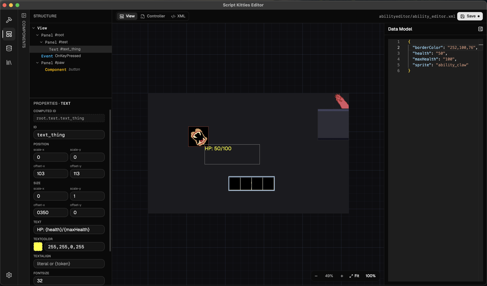

# Script Kitties Editor

A Tauri 2 desktop app for editing the `worlds-cpp` game's data. It
reads and writes the game's JSON files (abilities, creatures, items, charms, biograms,
effects, DLC) directly from a configurable game-install directory, with sprite previews,
schema-driven edit forms, a creature balancing view, and a visual GUI editor.



## Features

- **GUI Editor** — a visual editor for the game's GUI components (XML layouts + optional Lua
  controllers), sourced from the project's `gui/` folder. Browse components in a folder tree,
  edit the element hierarchy and properties, and see a **live preview** on a blueprint canvas
  with zoom/pan and drag-to-move. Properties bind to a **data model** that auto-scaffolds from
  the layout's `{token}` references; named colors come from an editable palette; a Lua
  controller tab and a live XML view sit alongside the preview. Undo/redo, Cmd/Ctrl+S save, and
  live reload when files change on disk.
- **Data Tables** — browse, search, and edit abilities, biograms, charms, effects, and
  items. Items join their `itemDropTable` entry (rarity, value, biome) in one row.
- **Creature Editor** — edit a creature's base stats and per-level growth in one grid,
  manage base + per-level ability unlocks, and view a **progression chart** that projects
  any stat across levels 1–25 against the average and max of every other creature, for
  balancing.
- **Live game files** — saves write back to the game's JSON atomically and minimally; an
  on-disk watcher keeps the app in sync when files change outside it.

## Prerequisites

- [Bun](https://bun.sh) — package manager and runner
- [Rust](https://www.rust-lang.org/tools/install) toolchain (for the Tauri backend)
- Platform [Tauri prerequisites](https://tauri.app/start/prerequisites/) (system webview / build deps)
- A local checkout of the game data repo (`worlds-cpp`)

## Setup

```bash
bun install
```

The app needs to know where the game is installed. On first run it creates
`editor.conf.json` with an empty `gameInstallPath`; set it (via the in-app settings, or by
editing the file) to the game root — the directory that contains `assets.json` and a
`Data/` folder of JSON files, e.g. `…/worlds-cpp/worlds-cpp`.

## Develop

```bash
bun tauri dev      # run the full app (frontend + Rust backend)
```

`bun dev` runs only the Vite frontend; backend `invoke` calls won't work without Tauri.

## Build

```bash
bun build          # type-check + bundle the frontend
bun tauri build    # produce a distributable desktop binary
```

## Quality

```bash
bun lint           # Biome check
bun format         # Biome check --write
bunx tsc --noEmit  # type-check
cargo build        # from src-tauri/, for Rust changes
```

## Project structure

See [CLAUDE.md](./CLAUDE.md) for an architecture overview: the React `src/` layout, the
Rust `src-tauri/` data-access layer and Tauri command bridge, the data/sprite resolution
flow, and the conventions for adding entities and commands.

## Tech stack

React 19 · TypeScript · Vite 6 · Tailwind 4 · shadcn/ui · Recharts · Tauri 2 · Rust · Serde · Moka
